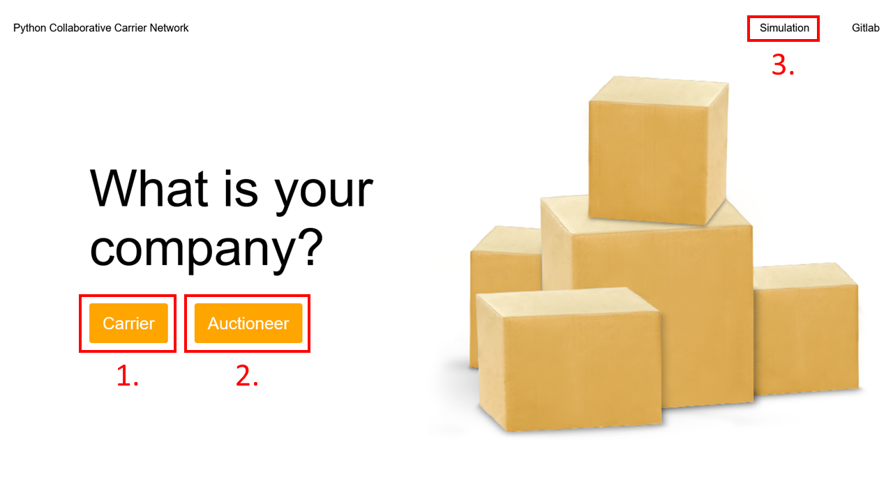

# Python Collaborative Carrier Network

## Description
The objective of this project is to implement a system that facilitates the reassignment of transport requests in a manner that increases the profit margins of participating delivery companies (carriers). This is to be achieved with an auction-based solution that respects the privacy of individual carriers while maximizing the efficiency of the entire network. The proposed solution uses an auctioneer agent to intelligently redistribute transport requests among participating carriers via auctions. The system ensures that the reassignment of transport requests is executed in a manner that either maintains or enhances the profit margins of all involved agents.

## Installation

1. Clone the repository

2. Download Python

    [Python Download](https://www.python.org/downloads)

3. Install dependencies

        pip install -r requirements.txt
        
## Agent Infrastructure 

* Use as Carrier
    
        cd Agent_Infrastructure
        python3 carrier_main.py [CVS File]

If no file is added for the carrier the requests are randomly generated.

* Use as Auctioneer

        cd Agent_Infrastructure
        python3 auctioneer_main.py

## Application

* Start application

        cd Application
        python3 app.py [portNumber]

It is advised to run a server on a different port for each client due to performance reasons.
After starting the server you can run the application at http://127.0.0.1:portNumber in a browser.

1. Use as Carrier

After adding delivery requests and the company name you can try to register for an auction.
Deliveries can be generated or uploaded.
Files in the supported format are in the folder 'example__requests'.

2. Use as Auctioneer

To start the server and the auction day click the button 'Start server'.
After the auction day ends the server is stopped.
To restart the server for a new auction day click the the now ornage button 'restart'.

3. Simulate

The simulation lets you simulate a specified amount of carriers with multiple console output.

## Authors

- Max Kretschmann
- Shachar Dan
- Lorenz Leddig
